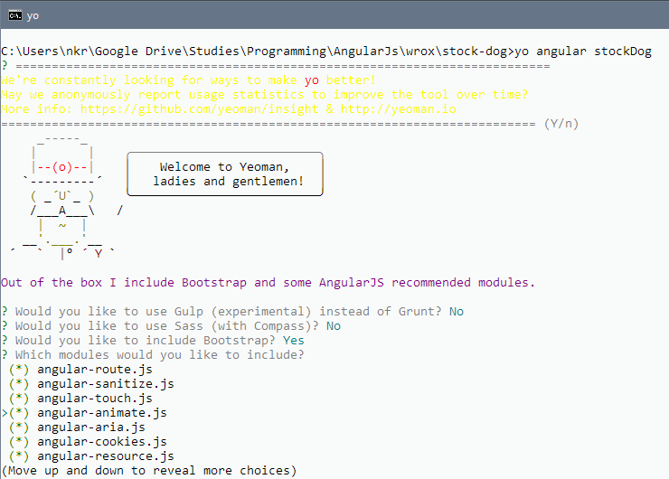
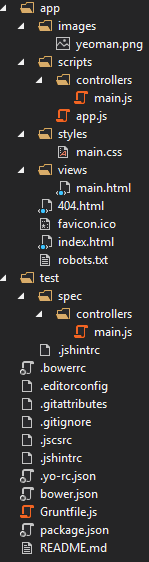

# Stock Dog Application

## Part 1: Scaffolding the project
We will use several tools to automate the development workflow.
Make sure you have [Node.js](http://nodejs.org/) and [Git](http://git-scm.com/downloads).

### Install Yeoman
Yeoman is an open source tool with an ecosystem of plug‐ins called generators that can be used to scaffold new projects with best practices.

Following are the tools Yeoman uses:
- **Grunt**—A JavaScript task runner that helps automate repetitive tasks for building and testing
your application
- **Bower**—A dependency management utility so you no longer have to manually download and
manage your front‐end scripts

Install the following packages:
- `npm install –g grunt-cli`
- `npm install –g bower`
- `npm install –g yo`
- `npm install –g generator-angular` (this is the official AngularJS generator maintained by the Yeoman team)

### Scaffolding the Project
Create a directory "stockdog" and then run the following Yeoman command:

`yo angular StockDog`



The following folder structure will be created:



`Grunfile.js` is of a particular interest because it configures several Grunt tasks that support your workflow during the development of the app.

Prior to run `grunt` you need to install the packages:
- `npm install`
- `bower install`

Run the following command to start the server using grunt:

`grunt serve`

This launches the local development server configured by Yeoman during the scaffolding process and opens the current skeleton application.

Cleanup unnecessary contents and files from the directory.
### Creating Watchlist

> **Module**: AngularJS modules declaratively specify how your components should be bootstrapped. Some advantages to this approach are that modules can
be loaded asynchronously in any order, and code readability and reusability are enhanced.

#### Installing module dependencies

**[AngularStrap](http://mgcrea.github.io/angular-strap/)** framework is used to bring some Bootstrap components into the app. For example its `$modal` service. Alternatively you can use [UI Bootstrap](http://angular-ui.github.io/bootstrap).

Use the following command to install AngularStrap:

`bower install angular-strap –save`

This command will install AngularStrap and will save it into bower.json. If you have left your application server running, which was launched using grunt serve, Grunt will have seen the modification to bower.json and automatically updated your index.html file to reference the CSS and JavaScript files that AngularStrap provides.

Add `mgcrea.ngStrap` module dependency at the end of dependencies in app.js module dependencies array.

```
.module('stockDogApp', [
  'ngAnimate',
  'ngAria',
  'ngCookies',
  'ngMessages',
  'ngResource',
  'ngRoute',
  'ngSanitize',
  'ngTouch',
  'mgcrea.ngStrap'
])
```

#### The Watchlist Service
[page 99]
